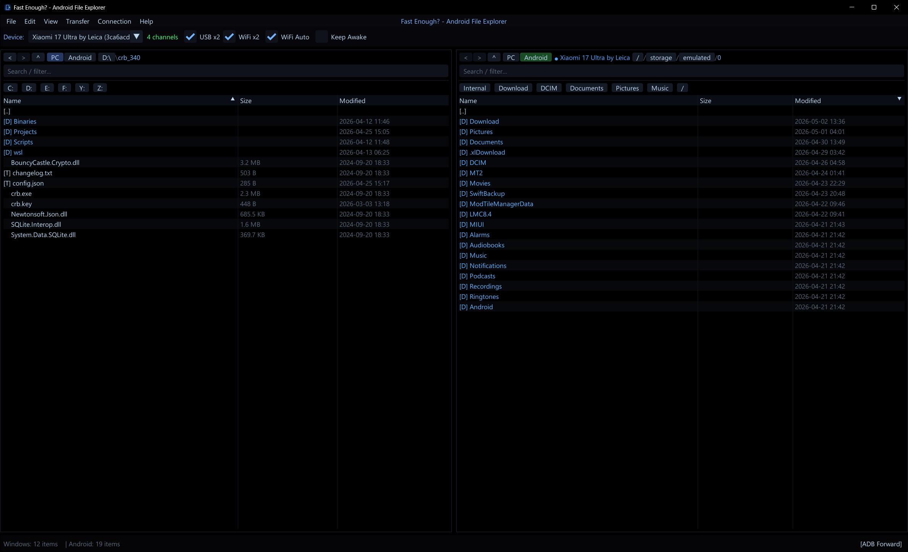
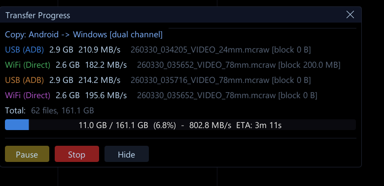

# Fast Enough

A Windows desktop app for high-speed file management on Android devices over USB. It replaces `adb push` / `adb pull` with a custom binary TCP protocol and a small native daemon that runs on the device.

Pre-built signed releases are published on the [Releases page](https://github.com/EkinStrop/FastEnough/releases) of this repository.

> **A note before you read on.** This is a hobby project, built with significant help from AI tooling. It started as a personal answer to how painfully slow MTP is on Android, and most of the design decisions reflect a workflow I actually use, not a generic blueprint. The code is offered as-is. Bugs, rough edges, and missing features are part of the deal, and I make no promises about fixing them on any schedule.
>
> You are welcome to take it, modify it, and adapt it to your own needs under the GPL-3.0 license. If you build on top of it, please be fair and credit the project. As far as I can tell, nobody else has put in the work to actually replace MTP on Android, and that took some real thought to get right.



## What it does

* Dual-pane file browser for one or two connected Android devices.
* Push, pull, delete, rename, mkdir, stat, CRC32 verify, and storage info.
* Mounts an Android device as a Windows drive letter via the Dokan user-mode filesystem.
* On-device streaming preview of MCRAW video files via the Windows Projected File System (ProjFS).
* Multi-pipe transfers: up to 4 parallel TCP streams (2 over USB and 2 over WiFi simultaneously) for higher sustained throughput on capable devices.
* Connects via ADB forward by default, with an optional Direct TCP path over USB tethering.

## Architecture

Two components:

1. **Windows client** (`src/`): C++20, Dear ImGui on DirectX 11. Handles UI, device discovery via ADB, transfer scheduling, Dokan mount, and ProjFS provider.
2. **Android server** (`server/afm-server.cpp`): a small ARM64 daemon pushed to `/data/local/tmp/afm-server` and started via `adb shell`. Listens on TCP port 5740. Pre-built into a static ELF and embedded into the client `.exe` as a Win32 resource, so no separate install on the device is needed.

The wire format and command codes are defined in `server/protocol.h`.

## Requirements

### Runtime (to use the app)

* Windows 10 or 11, x64.
* Android device with USB debugging enabled, authorized for the host.
* **Windows Projected File System** feature enabled (`Turn Windows features on or off` > `Windows Projected File System`). The app will not start without it.
* **Dokan 2.x** driver installed. The release ZIP includes `Dokan_x64.msi`; otherwise grab it from the [Dokan releases](https://github.com/dokan-dev/dokany/releases).

### Build (to compile from source)

* Visual Studio 2022 or newer with the Desktop C++ workload (MSBuild, Windows SDK, ATL is not required).
* PowerShell 5+ (for `setup.ps1`).
* Optional, only if you change the Android server: Android NDK r28 with `aarch64-linux-android21-clang++`.

## Building

### 1. Clone and fetch dependencies

```powershell
git clone https://github.com/EkinStrop/FastEnough.git
cd FastEnough
.\setup.ps1
```

`setup.ps1` downloads Dear ImGui v1.91.8 into `thirdparty/imgui/`. Other dependencies (Dokan headers and import libs, MotionCam decoder, AudioFile, simde, tinydng, nlohmann json) are vendored under `thirdparty/`.

### 2. Build the client

Open `Android File Manager.slnx` in Visual Studio and build, or from the command line:

```powershell
msbuild "Android File Manager.vcxproj" -p:Configuration=Release -p:Platform=x64
```

The output is `x64\Release\Fast Enough - Android File Explorer.exe`. For a Debug build, swap `Release` for `Debug`.

The build embeds the prebuilt server binary at `server/afm-server` as a resource. If you only changed C++ client code, you do not need to rebuild the server.

### 3. (Optional) Rebuild the Android server

Only required if you modify `server/afm-server.cpp` or anything it pulls in.

```powershell
$NDK = "$env:LOCALAPPDATA\Android\Sdk\ndk\28.2.13676358"
$CXX = "$NDK\toolchains\llvm\prebuilt\windows-x86_64\bin\aarch64-linux-android21-clang++.exe"

& $CXX -O2 -static -std=c++17 -march=armv8-a+crc `
  -Ithirdparty/motioncam/include -Ithirdparty `
  -o server/afm-server `
  server/afm-server.cpp `
  thirdparty/motioncam/lib/Decoder.cpp `
  thirdparty/motioncam/lib/RawData.cpp `
  thirdparty/motioncam/lib/RawData_Legacy.cpp
```

After rebuilding the server, force a client rebuild (`-t:Rebuild`) so the new binary gets embedded.

## Running

1. Connect your Android device via USB and authorize the host when prompted.
2. Launch `Fast Enough - Android File Explorer.exe`.
3. The app pushes the server binary, starts it, and connects on TCP 5740.

### Virtual drive

Use `Mount as drive` from inside the app. The device shows up as `P:\` (or `Q:\` for a second device). This requires the Dokan driver listed in [Requirements](#runtime-to-use-the-app).

### Wireless

Use the in-app Setup Wizard or pair via WiFi ADB from your device's developer settings. Once paired, transfers work the same way.

## Project layout

```
.
├── src/                     Windows client (ImGui + DX11)
├── server/                  Android server (C++17, static ARM64 ELF)
├── res/                     Icon and resource script (embeds server binary)
├── thirdparty/              Vendored dependencies (Dokan, MotionCam, simde, etc.)
├── setup.ps1                Fetches Dear ImGui
├── Android File Manager.vcxproj
└── README.md
```

Runtime data lives under `%APPDATA%\FastEnough\` (preferences, window state, ImGui layout).

## Performance notes

The push pipeline overlaps disk read, CRC32, and TCP send across three rotating buffers; the server overlaps recv with disk write. With 4 MB chunks and 16 MB socket buffers, a 13 GB file pushes in roughly 43 seconds on a single USB 3 link (about 312 MB/s).

### Multi-pipe transfers

A single TCP stream over `adb forward` is rarely the bottleneck of the storage on either side, but it is bounded by the throughput of one transport endpoint. Fast Enough can split a transfer across multiple parallel streams to use more of the available bandwidth at once. The number of pipes per transport is configurable in Preferences (`USB pipes` and `WiFi pipes`, each 1 or 2).

Supported configurations:

| USB pipes | WiFi pipes | Total streams | Typical use |
|-----------|------------|---------------|-------------|
| 1 | 0 | 1 | Default, works on any device |
| 2 | 0 | 2 | USB 3.x phone, no wireless setup needed |
| 0 | 2 | 2 | Cable-free workflow on a fast WiFi link |
| 2 | 2 | 4 | Maximum throughput, USB and WiFi run in parallel |

The 4-pipe mode lights up when:

* The phone is connected over USB 3.1 Gen 2 or USB 3.2 (5 Gbps or 10 Gbps), and
* The phone and host share a WiFi 6E or WiFi 7 network on the 6 GHz band with a clear path to the access point.

On flagship hardware that meets both conditions (for example a Snapdragon 8 Gen 3 / 8 Elite phone with UFS 4.0 storage paired with a WiFi 7 router and a USB 3.2 host port), a single large file can push at sustained rates near **800 MB/s**, with the bottleneck moving to the device's internal storage rather than to either transport.



Throughput scales sub-linearly: each added pipe adds bandwidth but also adds CPU and memory pressure on the phone, so 2 pipes on a midrange device may already be the sweet spot. The app monitors per-channel speed and falls back gracefully if a channel stalls or disconnects mid-transfer.

For multi-NIC hosts (a wired Ethernet adapter that bridges to the phone's hotspot, plus the host's primary WiFi, etc.), see `Connection > Multi-NIC Configuration` to pick which interface each WiFi pipe binds to.

## License

Fast Enough is released under the [GNU General Public License v3.0](LICENSE). You are free to use, modify, and redistribute it, including commercially, as long as any distributed derivative work is also released under GPL-3.0 with full source available. Use in closed-source projects is not permitted.

---

Made by [@JohnTheFarmer](https://github.com/EkinStrop).
